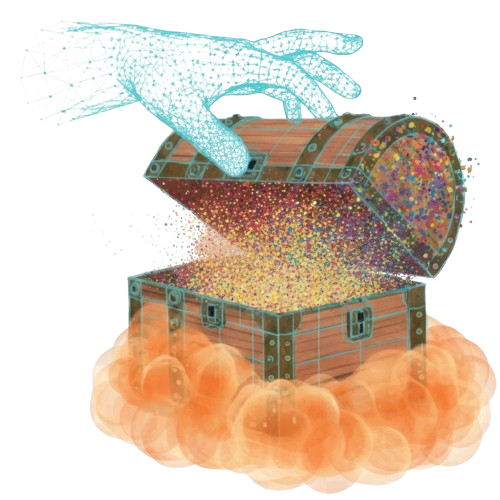

<p align="center">

  <div align="center" style="display: flex; align-items: center; justify-content: center; gap: 20px;">
    
    <h1 align="center"><a href="#" target="_blank">Advances in 4D Representation: Geometry, Motion and Interaction</a></h1>
  </div>

  <p align="center">
    <a href="https://mingrui-zhao.github.io/" target="_blank"><strong>Mingrui Zhao</strong></a>
    ·
    <a href="https://sauradip.github.io/" target="_blank"><strong>Sauradip Nag</strong></a>
    ·
    <a href="https://kwang-ether.github.io/" target="_blank"><strong>Kai Wang</strong></a>
    ·
    <a href="https://aditya-vora.github.io/" target="_blank"><strong>Aditya Vora</strong></a>
    ·
    <a href="https://quantaji.github.io/" target="_blank"><strong>Guangda Ji</strong></a>
    ·
    <a href="https://ca.linkedin.com/in/peter-chun-87416646" target="_blank"><strong>Peter Chun</strong></a>
    ·
    <a href="https://arash-mham.github.io/" target="_blank"><strong>Ali Mahdavi-Amiri</strong></a>
    ·
    <a href="https://www.cs.sfu.ca/~haoz/" target="_blank"><strong>Hao (Richard) Zhang</strong></a>
    <br />
    <i>ArXiv, 2025</i>    
  </p>

  <p align="center">
    <a href="#" target="_blank"><strong>Paper</strong></a>
    |
    <a href="#" target="_blank"><strong>Project Page</strong></a>
  </p>
</p>

We present a comprehensive survey on 4D generation and reconstruction, a fast-evolving subfield of computer graphics whose developments have been propelled by recent advances in neural fields, geometric and motion deep learning, as well 3D generative artificial intelligence (GenAI). While our survey is not the first of its kind, we build our coverage of the domain from a unique and distinctive perspective of 4D *representations*, to model 3D geometry evolving over time while exhibiting motion and interaction. Specifically, instead of offering an exhaustive enumeration of many works, we take a more selective approach by focusing on representative works to highlight both the desirable properties and ensuing challenges of each representation under different computation, application, and data scenarios. The main take-away message we aim to convey to the readers is on how to select and then customize the appropriate 4D representations for their tasks. Organizationally, we separate the 4D representations based on three key pillars: *geometry*, *motion*, and *interaction*. Our discourse will not only encompass the most popular representations of today, such as neural radiance fields (NeRFs) and 3D Gaussian Splatting (3DGS), but also bring attention to relatively under-explored representations in the 4D context, such as *structured* models and long-range motions. Throughout our survey, we will reprise the role of large language models (LLMs) and video foundational models (VFMs) in a variety of 4D applications, while steering our discussion towards their current limitations and how they can be addressed. We also provide a dedicated coverage on what 4D datasets are currently available, as well as what is lacking, in driving the subfield forward.

## About This Survey

## 📊 Survey Statistics

- **Total Papers:** 76+ papers
- **Representation Types:** NeRF, Gaussian Splatting, Mesh, Point Cloud, Voxel, Template, Graph
- **Task Categories:** Scene, Object, Human, Face, Hand
- **Input Modalities:** Text-to-4D, Image-to-4D, Video-to-4D, Point-to-4D, Mesh-to-4D, 3D-to-4D
- **Motion Types:** Deformation, Articulation, Space-Time, Tracking, Scene Graph

## 🚀 Submit Your Paper

We welcome contributions to this survey! If you have a paper related to 4D representations, dynamic 3D content, or spatiotemporal 3D understanding, please submit it using our GitHub issue template.

### How to Submit

1. **Go to the [Issues](https://github.com/your-username/4D-Survey/issues) page**
2. **Click "New Issue"**
3. **Select "Submit Paper to 4D Survey" template**
4. **Fill in all required fields:**
   - Paper title, authors, year, venue
   - Paper URL and project page (if available)
   - Code repository (if available)
   - Representation type, task, and category
   - Motion type and interaction capabilities
   - Complete BibTeX entry
   - Teaser image (PNG format only)
5. **Submit the issue**

### Submission Requirements

#### Required Information
- **Paper Title:** Full title of your paper
- **Authors:** All authors in "Firstname Lastname" format
- **Publication Details:** Year, venue, paper URL
- **Technical Classification:** Representation type, task, category, motion type
- **BibTeX Entry:** Complete citation in BibTeX format
- **Teaser Image:** PNG image showing your results

#### Optional Information
- **Project Page:** Official project webpage
- **Code Repository:** GitHub or other code repository
- **Interaction Method:** How the interactions are modeled, if any


#### Image Requirements
- **Format:** PNG only 
- **Naming:** Should be `[paper-name].png` (e.g., `in24d.png`)

### Review Process

1. **Automatic Processing:** Your submission will be automatically processed and converted to our JSON format
2. **Pull Request Creation:** A pull request will be created with your paper data
3. **Review:** We'll review the submission for relevance and completeness
4. **Approval:** If approved, your paper will be added to the survey
5. **Notification:** You'll be notified when your paper is included

## 📁 Repository Structure

```
4D-Survey/
├── data/                           # Paper JSON files
│   ├── 4d-fy.json                 # Individual paper data
│   ├── 4dgs.json
│   ├── ...
│   └── paper-list.json            # Complete paper list
├── images/                         # Paper teaser images
│   ├── 4d-fy.png
│   ├── 4dgs.png
│   └── ...
└── index.html                     # Survey website
```

## Citation

If you found our survey helpful, please consider citing:

```bibtex
@article{zhao2024advances4d,
    title={Advances in 4D Representation: Geometry, Motion and Interaction},
    author={Mingrui Zhao and Sauradip Nag and Kai Wang and Guangda Ji and Aditya Vora and Peter Chun and Ali Mahdavi-Amiri and Richard Hao Zhang},
    journal={[Journal Name]},
    year={2024},
    note={[To be added]}
}
```

---

**Ready to contribute?** 🚀

[Submit your paper now](https://github.com/your-username/4D-Survey/issues/new/choose) and help us build the most comprehensive 4D representation survey!