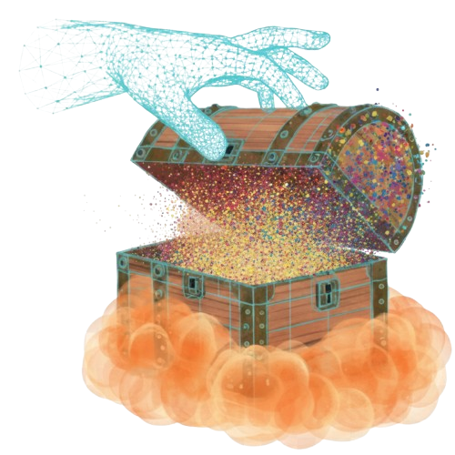

<p align="center">

  <div align="center" style="display: flex; align-items: center; justify-content: center; gap: 20px;">
    
    <h1 align="center"><a href="https://arxiv.org/abs/2510.19255" target="_blank">Advances in 4D Representation: Geometry, Motion and Interaction</a></h1>
  </div>

  <p align="center">
    <a href="https://mingrui-zhao.github.io/" target="_blank"><strong>Mingrui Zhao</strong></a>
    ·
    <a href="https://sauradip.github.io/" target="_blank"><strong>Sauradip Nag</strong></a>
    ·
    <a href="https://kwang-ether.github.io/" target="_blank"><strong>Kai Wang</strong></a>
    ·
    <a href="https://aditya-vora.github.io/" target="_blank"><strong>Aditya Vora</strong></a>
    ·
    <a href="https://quantaji.github.io/" target="_blank"><strong>Guangda Ji</strong></a>
    ·
    <a href="https://ca.linkedin.com/in/peter-chun-87416646" target="_blank"><strong>Peter Chun</strong></a>
    ·
    <a href="https://arash-mham.github.io/" target="_blank"><strong>Ali Mahdavi-Amiri</strong></a>
    ·
    <a href="https://www.cs.sfu.ca/~haoz/" target="_blank"><strong>Hao (Richard) Zhang</strong></a>
    <br />
    <i>Computer Graphics Forum (CGF), 2026</i>    
  </p>

  <p align="center">
    <b>🎉 Accepted to Computer Graphics Forum (CGF) 2026!</b>
  </p>

  <p align="center">
    <a href="https://arxiv.org/abs/2510.19255" target="_blank"><strong>Paper</strong></a>
    |
    <a href="https://mingrui-zhao.github.io/4DRep-GMI/" target="_blank"><strong>Project Page</strong></a>
  </p>
</p>

We present a comprehensive survey on 4D generation and reconstruction, a fast-evolving subfield of computer graphics whose developments have been propelled by recent advances in neural fields, geometric and motion deep learning, as well 3D generative artificial intelligence (GenAI). While our survey is not the first of its kind, we build our coverage of the domain from a unique and distinctive perspective of 4D *representations*, to model 3D geometry evolving over time while exhibiting motion and interaction. Specifically, instead of offering an exhaustive enumeration of many works, we take a more selective approach by focusing on representative works to highlight both the desirable properties and ensuing challenges of each representation under different computation, application, and data scenarios. The main take-away message we aim to convey to the readers is on how to select and then customize the appropriate 4D representations for their tasks. Organizationally, we separate the 4D representations based on three key pillars: *geometry*, *motion*, and *interaction*. Our discourse will not only encompass the most popular representations of today, such as neural radiance fields (NeRFs) and 3D Gaussian Splatting (3DGS), but also bring attention to relatively under-explored representations in the 4D context, such as *structured* models and long-range motions. Throughout our survey, we will reprise the role of large language models (LLMs) and video foundational models (VFMs) in a variety of 4D applications, while steering our discussion towards their current limitations and how they can be addressed. We also provide a dedicated coverage on what 4D datasets are currently available, as well as what is lacking, in driving the subfield forward.

## About This Survey

Rather than enumerate every paper in the field, we curate **representative** works and
read them through a single lens — the **4D representation** that models 3D geometry
evolving over time. We organize the field around three pillars:

- **Geometry** — how a method represents shape (Mesh, Point Cloud, NeRF, Gaussian
  Splatting, Template, Part, Graph, …).
- **Motion** — how that geometry changes over time (deformation, articulation,
  tracking, space-time, per-frame).
- **Interaction** — how moving 3D entities interact with each other and the world
  (human–object, human–scene, hand–object, and the pose / contact / affordance /
  physical-regulation aspects involved).

The companion **[interactive project page](https://mingrui-zhao.github.io/4DRep-GMI/)**
turns this taxonomy into a living, searchable catalog that stays up to date as the
field moves.

## 🔎 Explore the Interactive Survey

Visit the **[project page](https://mingrui-zhao.github.io/4DRep-GMI/)** to browse every
paper interactively:

- **Search & filter** across the full taxonomy — geometry, motion, generative prior,
  input condition, training strategy, interaction type, target, venue, year, and code
  availability.
- **Grid ⇄ table views** — scan rich cards with teaser figures, or switch to a dense,
  sortable comparison table.
- **Color-coded tags & legend** so each geometry family is recognizable at a glance.
- **Dark mode, mobile-friendly, and fast** — the whole catalog loads in a single
  request, with one-click BibTeX for every entry.

## 📊 At a Glance

- **113 representative works** — including **14** with dataset contributions, **3**
  surveys, and **22** interaction-centered methods; **85** ship public code.
- **Geometry:** Mesh · Point Cloud · NeRF · Gaussian Splatting · Template · Part ·
  Graph · Image
- **Motion:** Deformation · Articulation · Tracking · Space-Time · Per-frame · Scene Graph
- **Generative prior:** Foundation Model (FM) · Trained-on-own-Data (TD) · Input-only ·
  LLM · Human-template — including cascades such as `FM+TD`
- **Input condition:** Text · Image · Video · Multi-view · Point Cloud · Mesh · …
- **Training strategy:** Per-scene · Feed-forward · Hybrid
- **Interaction:** HOI (human–object) · HSI (human–scene) · HHI (human–human) ·
  Hand–object, with pose / contact / affordance / physical-regulation aspects
- **Targets:** Scene · Object · Human · Hand

## 🚀 Contribute Your Paper

We welcome contributions! If you have a paper on 4D representations, dynamic 3D
content, or spatiotemporal 3D understanding, add it in a few clicks — no coding needed.

1. Open the **[paper submission form](https://github.com/mingrui-zhao/4DRep-GMI/issues/new?template=submit_paper.yml)**
   (a guided GitHub issue template).
2. Fill in the details:
   - **Required:** title, authors, year, venue, paper URL, BibTeX, and the taxonomy
     tags (geometry, motion, target, category).
   - **Recommended:** project page, code repository, generative prior, input condition,
     training strategy, and interaction type — the same axes used throughout the survey.
   - **Teaser image:** a PNG named `[paper-name].png` (e.g. `in24d.png`).
3. Submit. Our automation converts the issue into a paper record and opens a pull
   request; we review it for relevance and accuracy before it appears on the site.

You can also use the same form to flag a **correction** (e.g. a mis-tagged paper) or an
**update** (code released, new venue).

## 📁 How This Repository Is Organized

This is a dependency-light **static website** — no framework, no server — designed to
load fast and stay easy to maintain.

```
4DRep-GMI/
├── index.html      # The entire website: one self-contained page
├── data/           # The paper catalog
│   ├── <paper>.json    # One editable record per paper (the source of truth)
│   └── papers.json     # A single bundled file the website loads in one request
├── images/         # Optimized WebP teaser figures (lazy-loaded)
└── scripts/        # Small helpers that assemble the bundle and keep tags consistent
```

**The pipeline, briefly:** each paper lives as its own small JSON record. A build step
compiles those records into one consolidated `papers.json` so the page loads everything
in a single fast request, validates the taxonomy, and optimizes teaser images to
lightweight WebP. The taxonomy tags mirror the tables in the published survey, and a
consistency check keeps the website and the paper in agreement. Contributions through
the form above flow through this same pipeline automatically.

## 📫 Contact

Questions, corrections, or suggestions are very welcome — open an issue or email
**[mza143@sfu.ca](mailto:mza143@sfu.ca)**. If you find this resource useful, please
consider giving the repo a ⭐.

## Citation

If you found our survey helpful, please consider citing:

```bibtex
@article{zhao2026advances4drepresentation,
      title={Advances in 4D Representation: Geometry, Motion, and Interaction},
      author={Mingrui Zhao and Sauradip Nag and Kai Wang and Aditya Vora and Guangda Ji and Peter Chun and Ali Mahdavi-Amiri and Hao Zhang},
      journal={Computer Graphics Forum},
      year={2026},
      url={https://arxiv.org/abs/2510.19255},
}
```
